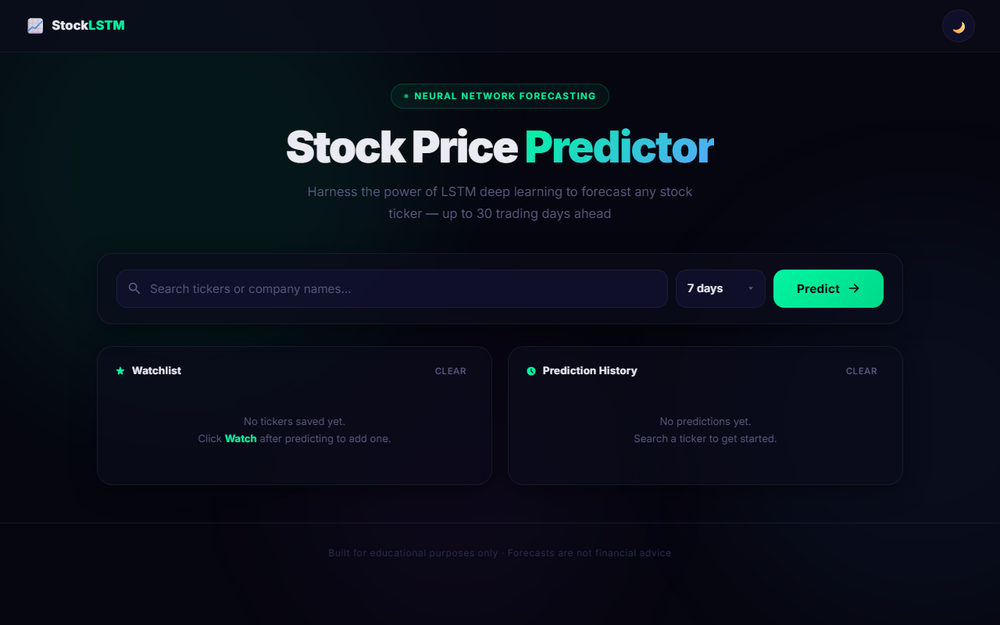
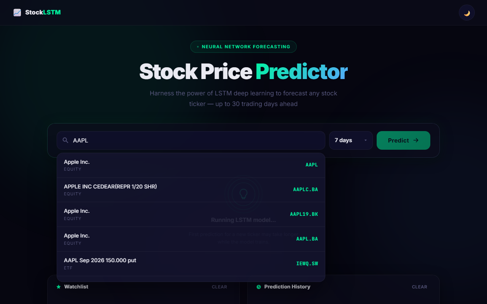
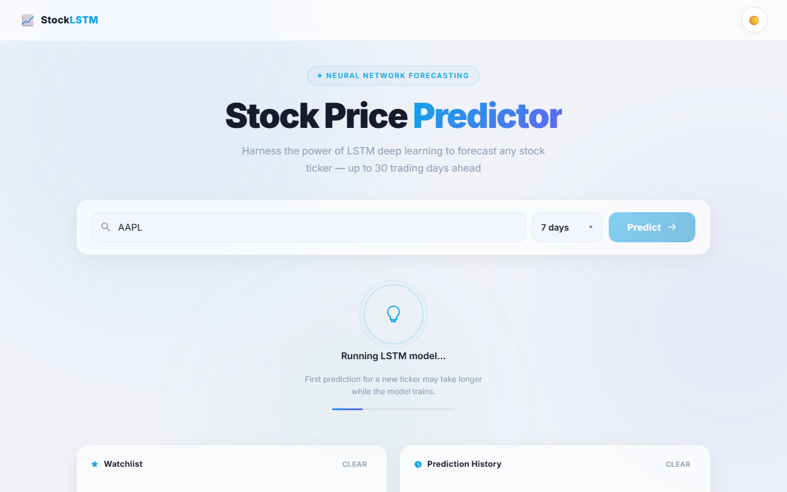
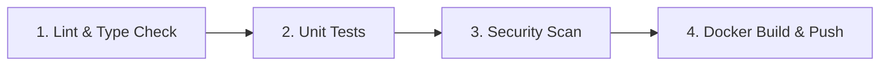

# StockLSTM — AI Stock Price Predictor

[](LICENSE)
[](https://www.python.org/)
[](https://fastapi.tiangolo.com/)
[](https://react.dev/)
[](https://www.tensorflow.org/)
[](https://www.docker.com/)
[](https://github.com/AnasBabari/stock-predictor-lstm/actions)

StockLSTM is a stock price forecasting application built with **FastAPI**, **React**, **Vite**, and **TensorFlow**. It fetches historical price data from Yahoo Finance, trains or loads cached LSTM neural network models, predicts future closing prices (3 to 30 trading days), and presents interactive visualizations.

---

## Features

- **LSTM Forecasting**: Multi-step stock price prediction (3, 7, 14, or 30 trading days) using 2-layer LSTM models.
- **Model Evaluation Metrics**: Computes RMSE, MAE, MAPE, R², and Directional Accuracy. Evaluation metrics are computed on a held-out test split from the downloaded historical data.
- **Scaler & Model Persistence**: Serializes fitted `MinMaxScaler` objects alongside trained `.keras` models to ensure preprocessing during inference matches training.
- **Automatic Staleness Detection**: Retrains cached models automatically when historical price data exceeds 7 days.
- **React Frontend**: Single-page application built with Vite, CSS variables, and modular component architecture.
- **Interactive Charts**: Line charts powered by Chart.js with dynamic timeframe selection (`1W`, `1M`, `3M`, `6M`, `1Y`) and CSV/PNG export options.
- **Company Overview & Autocomplete**: Real-time ticker search autocomplete and metadata dashboard (Market Cap, P/E ratio, 52-week High/Low, Volume).
- **Watchlist & History**: Persists user watchlists and past predictions using browser local storage.

---

## 📸 Screenshots

| Hero Dashboard | Prediction Chart |
| :---: | :---: |
|  |  |

| Company Overview | Dark Mode |
| :---: | :---: |
|  |  |

---

## 🚀 Quick Start with Docker

Run the full-stack application locally using Docker Compose:

1. Clone the repository:
   ```bash
   git clone https://github.com/AnasBabari/stock-predictor-lstm.git
   cd stock-predictor-lstm
   ```

2. Build and start containers:
   ```bash
   docker compose up --build
   ```

3. Open your browser and navigate to `http://localhost:5500`.

*Note: Initial predictions for new tickers train an LSTM model on demand. Subsequent predictions load cached models immediately.*

---

## 💻 Local Development Setup

### 1. Backend Setup

Navigate to the `backend` directory, create a virtual environment, and install dependencies:

```bash
cd backend
python -m venv venv

# On Linux/macOS:
source venv/bin/activate

# On Windows (PowerShell):
.\venv\Scripts\Activate.ps1

# Install requirements
pip install -r requirements.txt -r requirements-dev.txt
```

Create your environment file from `.env.example`:
```bash
cp .env.example .env
```

Start the backend server using Uvicorn:

```bash
uvicorn api:app --reload --port 8000
```
The API will be available at `http://127.0.0.1:8000`. Interactive API documentation is available at `http://127.0.0.1:8000/docs`.

### 2. Frontend Setup

In a separate terminal, navigate to the `frontend` directory, install Node packages, and launch the Vite development server:

```bash
cd frontend
# cp .env.example .env  # Uncomment if you need to configure custom API URLs
npm install
npm run dev
```
The frontend application will run at `http://localhost:5500`.

---

## 🔐 Environment Variables

Before running the backend, create a `.env` file by copying `.env.example`:

```bash
cp backend/.env.example backend/.env
```

| Environment Variable | Default Value | Description |
| :--- | :--- | :--- |
| `ALLOWED_ORIGINS` | `["http://localhost:5500","http://127.0.0.1:5500"]` | JSON array of CORS allowed origins |
| `RATE_LIMIT_PREDICT` | `5/minute` | Rate limit for `/api/v1/predict` endpoint |
| `RATE_LIMIT_SEARCH` | `30/minute` | Rate limit for `/api/v1/search` endpoint |
| `RATE_LIMIT_INFO` | `20/minute` | Rate limit for `/api/v1/info` endpoint |
| `PREDICT_CACHE_TTL` | `300` | Prediction cache TTL in seconds |
| `INFO_CACHE_TTL` | `3600` | Stock info cache TTL in seconds |
| `CACHE_MAX_SIZE` | `500` | Maximum items in in-memory cache |

---

## 🧠 Scaler & Model Persistence

Models (`.keras`) and fitted `MinMaxScaler` instances (`.joblib`) are serialized together in `backend/saved_models/`. Reusing the exact fitted scaler instance during inference ensures input preprocessing matches training data and prevents prediction drift caused by refitting on new market data.

---

## 🏗 Project Structure

```text
stock-predictor-lstm/
├── .github/
│   └── workflows/
│       └── main.yml           # GitHub Actions CI/CD Pipeline
├── backend/
│   ├── api.py                 # FastAPI endpoints & middleware
│   ├── data_pipeline.py       # YFinance data retrieval & feature scaling
│   ├── model.py                # LSTM model architecture & persistence
│   ├── requirements.txt       # Production dependencies
│   ├── requirements-dev.txt   # Development & test dependencies
│   ├── saved_models/          # Model (.keras) and scaler (.joblib) artifacts
│   └── tests/                 # Unit and integration tests
├── frontend/
│   ├── Dockerfile             # Multi-stage build (Node -> Nginx)
│   ├── package.json           # React & Vite dependencies
│   ├── vite.config.js         # Vite configuration & API proxy
│   └── src/
│       ├── main.jsx           # Application entry point
│       ├── App.jsx            # Main container & state management
│       ├── styles.css         # UI styles and CSS variables
│       └── components/        # UI components
├── docs/
│   └── images/                # Application screenshots
├── docker-compose.yml         # Container orchestration
└── README.md
```

---

## 🚀 CI/CD Pipeline

StockLSTM uses **GitHub Actions** ([`main.yml`](file:///.github/workflows/main.yml)) for continuous integration and automated container builds on pushes to `main` and `develop`.



### Pipeline Steps
1. **Lint & Type Check**: Checks formatting with `ruff`, runs static typing with `mypy`, and scans React components.
2. **Unit Tests**: Runs backend tests with `pytest` and exports coverage reports.
3. **Security Scan**: Performs static code security analysis using `bandit`.
4. **Docker Build & Push**: Builds container images with Docker Buildx and pushes them to GitHub Container Registry (GHCR):
   - `ghcr.io/anasbabari/stock-predictor-lstm/backend:latest`
   - `ghcr.io/anasbabari/stock-predictor-lstm/frontend:latest`

---

## 📡 API Reference

| Endpoint | Method | Parameters | Description |
| :--- | :--- | :--- | :--- |
| `/api/v1/predict` | `GET` | `ticker` (str), `days` (int, default: 7) | Generates LSTM forecasts and evaluation metrics |
| `/api/v1/search` | `GET` | `query` (str) | Returns stock ticker autocomplete suggestions |
| `/api/v1/info` | `GET` | `ticker` (str) | Retrieves stock fundamental metadata |

---

## ⚠️ Disclaimer

> [!WARNING]
> This project is for **educational and research purposes only**. Stock price forecasts generated by machine learning models should not be used as financial or investment advice.

---

## 📄 License

This project is licensed under the [MIT License](LICENSE).