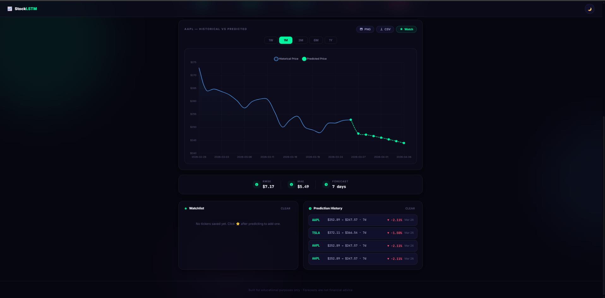
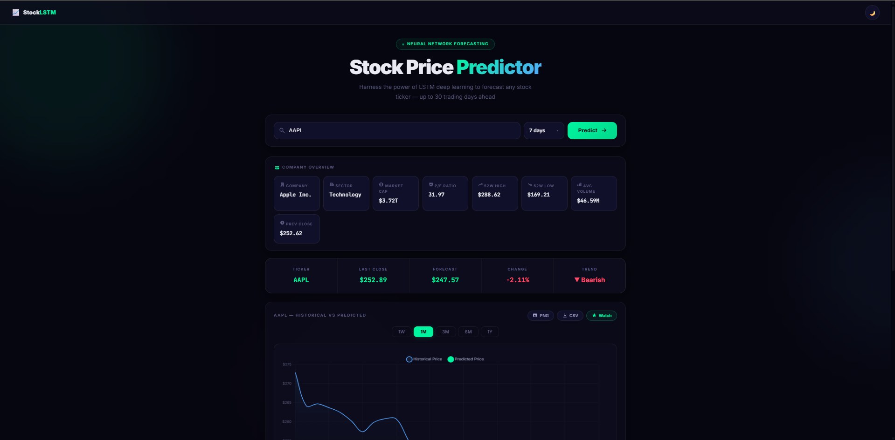
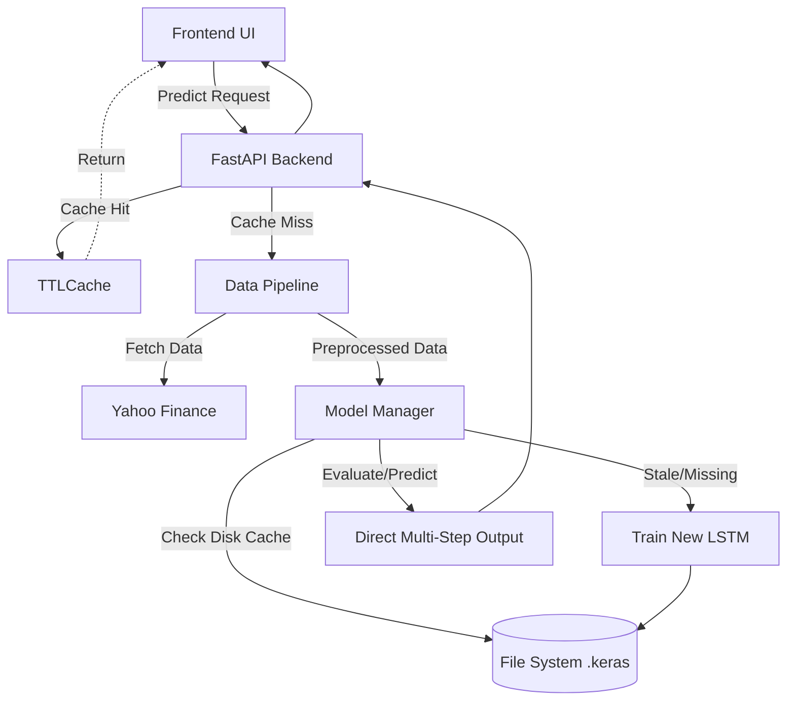

# StockLSTM

StockLSTM is a full-stack stock forecasting app that uses an LSTM neural network to predict the next 3–30 trading days of closing prices and visualize results in an interactive chart.

## Preview


*Modern glassmorphism interface with ambient background orbs*


*Interactive chart, detailed stock info, metrics, and prediction history*

## Features

### Core
- FastAPI backend for model inference
- Two-layer LSTM model trained on historical close prices from Yahoo Finance (`yfinance`)
- Configurable forecast horizon: **3, 7, 14, or 30 days**
- Saved model cache per ticker with **automatic staleness detection** (retrains after 7 days)
- **EarlyStopping** callback to prevent overfitting
- **Model evaluation metrics** (RMSE, MAE, MAPE, R², DA) returned with every prediction

### Frontend
- Interactive Chart.js line chart with gradient fills
- Timeframe filters: `1W`, `1M`, `3M`, `6M`, `1Y`
- Dark / light theme toggle (persisted in localStorage)
- Company-name search with live ticker autocomplete
- **Stock info dashboard** — market cap, P/E ratio, 52-week range, volume, sector
- **Watchlist** — save favourite tickers (localStorage), one-click re-predict
- **Prediction history** — log of recent forecasts with change % and date
- **Export** — download chart as PNG or data as CSV
- **Toast notifications** for success, error, and info events
- Premium glassmorphism design with Inter font

### API
- `GET /api/v1/predict?ticker=AAPL&days=7` — forecast with configurable horizon
- `GET /api/v1/search?query=apple` — ticker autocomplete
- `GET /api/v1/info?ticker=AAPL` — rich stock metadata
- **In-memory caching** (bounded TTLCache) for predictions and info
- **Rate limiting** for all API endpoints 

## Architecture



## Quick Start with Docker

The easiest way to run StockLSTM locally is via Docker Compose:

1. Clone the repository and navigate to the project root:
   ```bash
   git clone https://github.com/AnasBabari/stock-predictor-lstm.git
   cd stock-predictor-lstm
   ```
2. Start the services:
   ```bash
   docker-compose up -d
   ```
3. Open your browser to `http://localhost:5500`.

*Note: The first prediction for a new ticker takes 2-5 minutes while the LSTM model trains and saves to the local docker volume cache. Subsequent calls and cached models load instantly.*

## Local Development Setup

### 1. Create Virtual Environment
```bash
cd backend
python -m venv venv
source venv/bin/activate  # On Windows: .\venv\Scripts\Activate.ps1
```

### 2. Install Dependencies
```bash
pip install -r requirements.txt
pip install -r requirements-dev.txt
```

### 3. Environment Variables
Create a `.env` file in the `backend/` directory based on `.env.example`.
```env
ALLOWED_ORIGINS=["http://localhost:5500","http://127.0.0.1:5500"]
RATE_LIMIT_PREDICT=5/minute
RATE_LIMIT_SEARCH=30/minute
RATE_LIMIT_INFO=20/minute
PREDICT_CACHE_TTL=300
INFO_CACHE_TTL=3600
CACHE_MAX_SIZE=500
```

### 4. Run Backend & Frontend
Backend:
```bash
uvicorn api:app --reload
```
Frontend: In another terminal, from the root of the project:
```bash
python -m http.server 5500
```
Open `http://localhost:5500/frontend/` in your browser.

## API Reference
- `GET /api/v1/predict?ticker=AAPL&days=7`
- `GET /api/v1/search?query=Apple`
- `GET /api/v1/info?ticker=AAPL`

See interactive docs at `http://127.0.0.1:8000/docs` while the backend is running.

## ⚠️ Disclaimer
> [!WARNING]
> This project is designed purely for educational and machine learning experimentation purposes. The generated model metrics (RMSE, MAE, MAPE, R², Directional Accuracy) are computed entirely against historical test partitions. They DO NOT guarantee future live-trading performance. The stock market is highly stochastic and relies on data not represented in lagging price indicators. **Never use these predictions as financial advice or for making real-world investments.**

## License
MIT