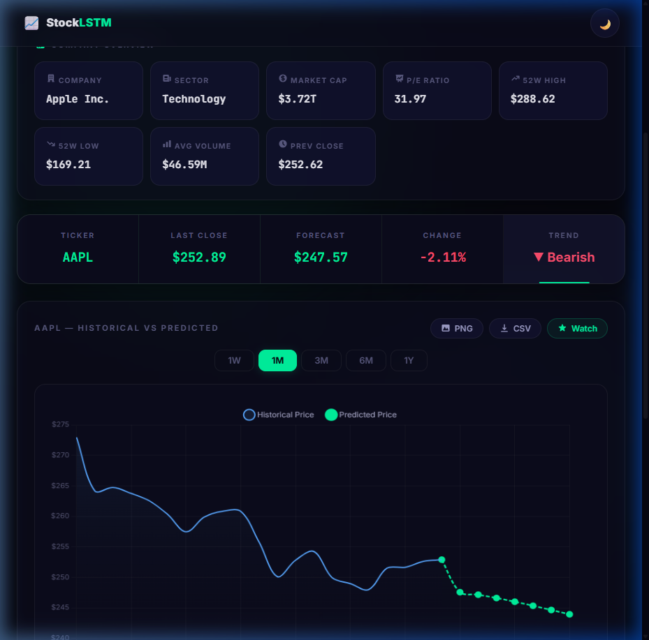

# StockLSTM

StockLSTM is a full-stack stock forecasting app that uses an LSTM neural network to predict the next 7 trading days of closing prices and visualize results in an interactive chart.

## Preview


*Interactive chart showing historical data and 7-day forecast with timeframe filters*

## Features

- FastAPI backend for model inference
- LSTM model trained on historical close prices from Yahoo Finance (`yfinance`)
- 7-day forecast with weekends skipped in future dates
- Saved model cache per ticker (`backend/saved_models/*_model.keras`)
- Interactive frontend with Chart.js
- Timeframe filters: `1W`, `1M`, `3M`, `6M`, `1Y`
- Dark/light theme toggle

## Project Structure

```text
stock-predictor-lstm/
	backend/
		api.py
		config.py
		data_pipeline.py
		model.py
		requirements.txt
		saved_models/
	frontend/
		index.html
		app.js
		styles.css
	assets/
		screenshot.png
	README.md
```

## Tech Stack

- Backend: FastAPI, Uvicorn
- ML: TensorFlow/Keras (LSTM), scikit-learn
- Data: yfinance, NumPy, Pandas
- Frontend: HTML, CSS, Vanilla JavaScript, Chart.js

## How It Works

1. Historical stock data is downloaded from Yahoo Finance.
2. Close prices are scaled with `MinMaxScaler`.
3. Sliding windows of 60 timesteps are created for training.
4. A per-ticker LSTM model is loaded from disk or trained if missing.
5. The backend predicts the next 7 values recursively.
6. The frontend displays recent historical data and forecasted points.

## Local Setup

### 1. Clone Repository

```bash
git clone https://github.com/AnasBabari/stock-predictor-lstm.git
cd stock-predictor-lstm
```

### 2. Create and Activate Virtual Environment

Windows (PowerShell):

```powershell
python -m venv .venv
.\.venv\Scripts\Activate.ps1
```

macOS/Linux:

```bash
python -m venv .venv
source .venv/bin/activate
```

### 3. Install Backend Dependencies

```bash
pip install -r backend/requirements.txt
```

### 4. Run Backend API

```bash
cd backend
uvicorn api:app --reload
```

Backend URL: `http://127.0.0.1:8000`

Interactive docs: `http://127.0.0.1:8000/docs`

### 5. Run Frontend

Use a lightweight local server from the project root:

```bash
python -m http.server 5500
```

Then open:

`http://127.0.0.1:5500/frontend/`

## API

### `GET /api/v1/predict?ticker=AAPL`

Returns historical dates/prices and 7 predicted future prices.

Example response:

```json
{
	"ticker": "AAPL",
	"historical_dates": ["2023-01-03", "..."],
	"historical_prices": [125.07, 126.36],
	"future_dates": ["2026-03-24", "2026-03-25"],
	"predicted_prices": [194.21, 195.03]
}
```

## Configuration

You can tune training/inference settings in `backend/config.py`:

- `HISTORICAL_YEARS`
- `WINDOW_SIZE`
- `TRAIN_SPLIT`
- `LSTM_UNITS`
- `EPOCHS`
- `BATCH_SIZE`
- `MODEL_DIR`

## Notes and Limitations

- This project is for educational and experimentation purposes only.
- Forecasts are based on historical price patterns and are not financial advice.
- Initial request for a new ticker may take longer because model training runs first.

## Future Improvements

- Let users type company names (like Apple) and automatically map them to ticker symbols (AAPL).
- Improve model quality by adding more signals, such as volume and key technical indicators.
- Make the API more resilient with better input checks, clearer error messages, and retry logic.
- Add automated tests and a simple CI (Continuous Integration) pipeline to catch bugs early.
- Make deployment easier with Docker, environment-based settings, and scheduled model retraining.

## Troubleshooting

- `Not enough data for training.`
	Use a ticker with sufficient historical data and keep `WINDOW_SIZE` reasonable.
- Slow first prediction for a ticker.
	Expected behavior: model is being trained and then cached.
- Frontend cannot connect to backend.
	Ensure backend is running on `http://127.0.0.1:8000` and CORS is enabled (already configured in `api.py`).

## License

MIT