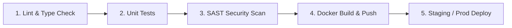

# StockLSTM — AI Stock Price Predictor

StockLSTM is a modern, full-stack stock price forecasting application powered by **FastAPI**, **Vite + React**, and **LSTM Deep Learning Neural Networks**. It fetches historical price data from Yahoo Finance, trains or loads cached LSTM models, predicts the next 3–30 trading days of closing prices, and renders interactive, customizable visualizations.

---

## 📸 Overview & Features

### Core Capabilities
- **Neural Network Forecasting**: Multi-step stock price prediction (3, 7, 14, or 30 trading days) using 2-layer LSTM models built with Keras & TensorFlow.
- **Scaler & Model Persistence**: Serializes fitted `MinMaxScaler` objects alongside trained `.keras` models to eliminate data scaling drift during inference.
- **Automatic Staleness Detection**: Disk-cached models automatically retrain if historical data is older than 7 days.
- **Model Evaluation Metrics**: Computes and returns RMSE, MAE, MAPE, R², and Directional Accuracy (DA) against test data partitions.
- **Vite + React Frontend**: High-performance React single-page application (SPA) with dynamic imports and modular components.
- **Interactive Charting**: Code-split Chart.js line charts with gradient fills, timeframe selectors (`1W`, `1M`, `3M`, `6M`, `1Y`), and PNG/CSV data exports.
- **Rich Company Overview & Autocomplete**: Instant search autocomplete and real-time metadata dashboard (Market Cap, P/E ratio, 52-week High/Low, Volume).
- **Watchlist & History**: Persists user watchlists and past predictions across browser sessions using local storage.

---

## ⚙️ Prerequisites

Before running StockLSTM, ensure you have the following installed:

- **Python**: `v3.11` or higher
- **Node.js**: `v20.0.0` or higher (with `npm`)
- **Docker & Docker Compose**: Needed for containerized deployment (Docker `v24+`)

---

## 🏗 Project Structure

```text
stock-predictor-lstm/
├── .github/
│   └── workflows/
│       └── main.yml           # Multi-stage GitHub Actions CI/CD Pipeline
├── backend/
│   ├── api.py                 # FastAPI endpoints, CORS, rate limiting, TTLCache
│   ├── data_pipeline.py       # YFinance downloader, scaler preprocessor, sequence windowing
│   ├── model.py                # LSTM architecture, model/scaler persistence & training lock
│   ├── requirements.txt       # Production dependencies
│   ├── requirements-dev.txt   # Testing & linting dependencies (pytest, ruff, mypy, bandit)
│   ├── saved_models/          # Cached .keras models and .joblib scalers
│   └── tests/                 # Unit & integration test suite
├── frontend/
│   ├── Dockerfile             # Multi-stage Docker build (Node build -> Nginx serve)
│   ├── package.json           # Frontend dependencies (React, Vite, Chart.js)
│   ├── vite.config.js         # Vite configuration and dev server proxy
│   └── src/
│       ├── main.jsx           # React application entry point
│       ├── App.jsx            # State management, API integration, theme persistence
│       ├── styles.css         # Glassmorphism design system & CSS variables
│       └── components/        # Modular React components
├── docker-compose.yml         # Container orchestration configuration
└── README.md
```

---

## 🧠 Technical Highlight: Why Scaler Persistence Matters

In machine learning pipelines for time-series forecasting, input features are normalized (typically using `MinMaxScaler` to scale prices into $[0, 1]$) prior to training the neural network.

```
       Training Phase:                          Inference Phase:
Raw Prices ──> Fit & Transform ──> Train LSTM ──> Saved Model (.keras)
                     │
              Save Scaler (.joblib) ───────────> Load Scaler & Inverse Transform
```

### The Problem: Scaler State Drift
If the `MinMaxScaler` is fit dynamically on live incoming data during inference rather than loaded from the exact fitted instance used during training:
1. **Min/Max Mismatch**: The historical minimum and maximum bounds will shift relative to recent market fluctuations.
2. **Feature Distortion**: Rescaling inputs with a newly fitted scaler distorts the normalized values fed into the LSTM layer.
3. **Prediction Error**: Re-inverting predicted outputs using an incorrect scale produces significant forecast drift.

### The Solution
StockLSTM serializes both the trained model (`<ticker>_model.keras`) and its corresponding scaler state (`<ticker>_scaler.joblib`) together. During inference, `model.py` and `api.py` retrieve the exact original scaler to transform inputs and inverse-transform prediction arrays, ensuring absolute numerical consistency.

---

## 🔐 Environment Variables

Configuration settings are loaded via environment variables in the `backend/` directory. Create a `.env` file based on `.env.example`:

| Environment Variable | Default Value | Description |
| :--- | :--- | :--- |
| `ALLOWED_ORIGINS` | `["http://localhost:5500","http://127.0.0.1:5500"]` | JSON array of CORS allowed origins |
| `RATE_LIMIT_PREDICT` | `5/minute` | Rate limit for `/api/v1/predict` endpoint |
| `RATE_LIMIT_SEARCH` | `30/minute` | Rate limit for `/api/v1/search` endpoint |
| `RATE_LIMIT_INFO` | `20/minute` | Rate limit for `/api/v1/info` endpoint |
| `PREDICT_CACHE_TTL` | `300` | Prediction in-memory TTLCache expiration (seconds) |
| `INFO_CACHE_TTL` | `3600` | Stock info TTLCache expiration (seconds) |
| `CACHE_MAX_SIZE` | `500` | Maximum number of cached items in TTLCache |

---

## 💻 Local Development Setup

### 1. Backend Setup

Navigate to the `backend` directory, create a virtual environment, and install dependencies:

```bash
cd backend
python -m venv venv

# On Linux/macOS:
source venv/bin/activate

# On Windows (PowerShell):
.\venv\Scripts\Activate.ps1

# Install requirements
pip install -r requirements.txt -r requirements-dev.txt
```

Start the backend server using Uvicorn:

```bash
uvicorn api:app --reload --port 8000
```
The API will be available at `http://127.0.0.1:8000`. Interactive Swagger API documentation can be accessed at `http://127.0.0.1:8000/docs`.

### 2. Frontend Setup

In a separate terminal, navigate to the `frontend` directory, install Node packages, and launch the Vite development server:

```bash
cd frontend
npm install
npm run dev
```
The frontend application will be live at `http://localhost:5500` with automatic hot module replacement (HMR).

---

## 🐳 Quick Start with Docker

You can run the full-stack application locally using Docker Compose:

1. Clone the repository:
   ```bash
   git clone https://github.com/AnasBabari/stock-predictor-lstm.git
   cd stock-predictor-lstm
   ```

2. Build and start containers in detached mode:
   ```bash
   docker-compose up -d --build
   ```

3. Open your browser and navigate to `http://localhost:5500`.

*Note: Initial predictions for new tickers train an LSTM model on demand, taking 15–45 seconds. Subsequent predictions for cached tickers load instantly.*

---

## 🚀 CI/CD Pipeline & Container Publishing

StockLSTM uses a multi-stage **GitHub Actions** workflow ([`main.yml`](file:///.github/workflows/main.yml)) triggered on pushes and pull requests to `main` and `develop`.



### Workflow Jobs
1. **Lint**: Validates Python formatting with `ruff` and enforces static typing with `mypy`.
2. **Test**: Executes `pytest` with coverage report generation.
3. **Security**: Runs static security analysis using `bandit`.
4. **Build & Publish**: Builds container images via Docker Buildx and publishes them to **GitHub Container Registry (GHCR)** under:
   - `ghcr.io/anasbabari/stock-predictor-lstm/backend:latest`
   - `ghcr.io/anasbabari/stock-predictor-lstm/frontend:latest`
5. **Deploy**: Triggers deployment pipelines to Staging (`develop` branch) or Production (`main` branch).

---

## 📡 API Reference

### `GET /api/v1/predict`
Generates LSTM predictions for a stock ticker.
- **Parameters**: `ticker` (string, required), `days` (int, default: 7)
- **Response**: Historical prices, predicted prices, future dates, and model metrics (`rmse`, `mae`, `r2`, `mape`, `directional_accuracy`).

### `GET /api/v1/search`
Searches for company names or tickers for autocomplete suggestions.
- **Parameters**: `query` (string, required)

### `GET /api/v1/info`
Fetches fundamental metadata for a given company.
- **Parameters**: `ticker` (string, required)
- **Response**: Market cap, P/E ratio, 52-week range, volume, sector.

---

## ⚠️ Disclaimer

> [!WARNING]
> This application is strictly for **educational and research purposes**. Stock market prices are influenced by unobservable factors, news, and systemic events not captured by historical price sequences alone. The generated predictions and model evaluation metrics **must never be used as financial or investment advice**.

---

## 📄 License

This project is licensed under the [MIT License](LICENSE).