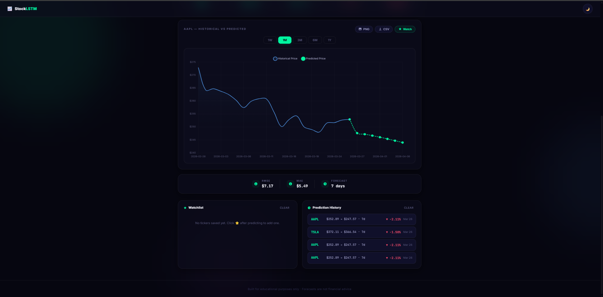
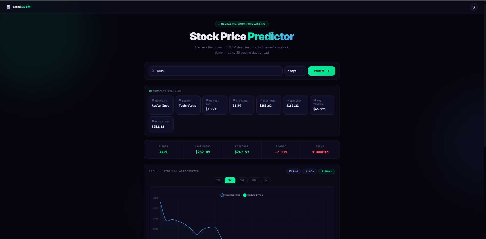
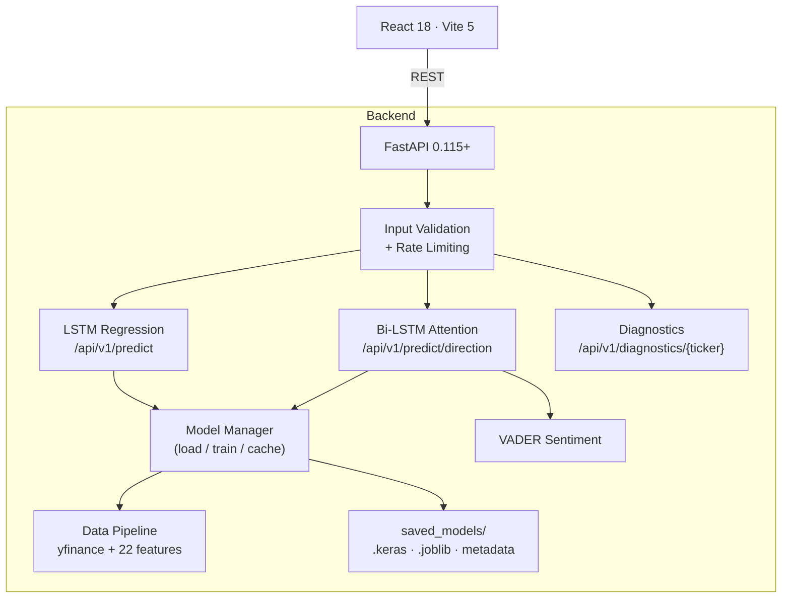
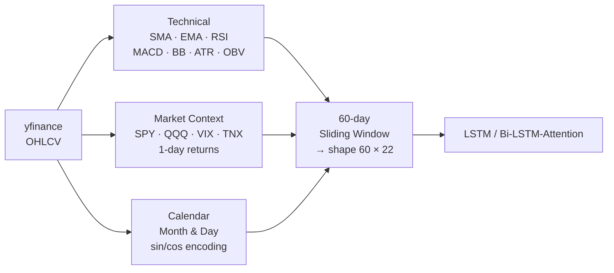
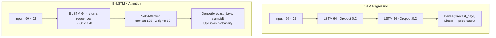
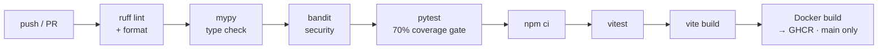

# StockLSTM — AI Stock Price Predictor

[](https://github.com/AnasBabari/stock-predictor-lstm/actions)
[](https://www.python.org/)
[](https://fastapi.tiangolo.com/)
[](https://react.dev/)
[](https://www.tensorflow.org/)
[](LICENSE)

---

**StockLSTM** is a full-stack stock forecasting application combining a **Bi-LSTM model with temporal attention** for directional prediction with an **LSTM regression model** for price forecasting. Historical data is sourced from Yahoo Finance; results are surfaced through a FastAPI backend and a responsive React dashboard.

> [!IMPORTANT]
> **Highlights**
> - Full-stack ML application — FastAPI backend + React 18 frontend
> - Bidirectional LSTM with temporal attention and interpretable attention weights
> - Walk-forward validation (5-fold expanding window)
> - 22 engineered features: OHLCV, technical indicators, market context, calendar
> - 53 automated backend tests · **80.5% test coverage**
> - GitHub Actions CI/CD with lint, type-check, security scan, and coverage gate

> ⚠️ **Disclaimer** — Educational project only. Not financial advice.

---

## Screenshots

| Price Forecast | Direction Forecast |
|---|---|
|  |  |

---

## Key Features

| Feature | Detail |
|---|---|
| **Bi-LSTM + Temporal Attention** | Directional classifier with per-timestep attention weights for interpretability |
| **Multi-step price regression** | LSTM model predicts raw closing prices for 1–30 trading days |
| **Walk-forward validation** | Configurable expanding / rolling / anchored 5-fold evaluation |
| **22-feature engineering pipeline** | OHLCV · 9 technical indicators · 4 market context features · 4 calendar features |
| **Sentiment integration** | VADER with financial lexicon applied to yfinance news headlines |
| **Model caching & staleness detection** | `.keras` + fitted `MinMaxScaler` persisted; auto-retrain after 7 days |
| **Diagnostics endpoint** | Per-fold residuals, cross-validation summary, dataset fingerprint |
| **Interactive React dashboard** | Chart.js charts, watchlist, timeframe selector, CSV/PNG/ZIP export |
| **Rate-limited API** | slowapi per-IP limits, explicit CORS origins, sanitised inputs |
| **GitHub Actions CI/CD** | ruff → mypy → bandit → pytest (70% gate) → Docker build & push to GHCR |

---

## Architecture


```mermaid
graph TD
    Browser["React 18 · Vite 5"] -->|REST| API["FastAPI 0.115+"]

    subgraph Backend
        API --> Val["Input Validation\n+ Rate Limiting"]
        Val --> Price["LSTM Regression\n/api/v1/predict"]
        Val --> Dir["Bi-LSTM Attention\n/api/v1/predict/direction"]
        Val --> Diag["Diagnostics\n/api/v1/diagnostics/{ticker}"]
        Price & Dir --> MM["Model Manager\n(load / train / cache)"]
        MM --> DP["Data Pipeline\nyfinance + 22 features"]
        MM --> Disk["saved_models/\n.keras · .joblib · metadata"]
        Dir --> News["VADER Sentiment"]
    end
```

### Feature Engineering Pipeline


```mermaid
graph LR
    Raw["yfinance\nOHLCV"] --> Tech["Technical\nSMA · EMA · RSI\nMACD · BB · ATR · OBV"]
    Raw --> Market["Market Context\nSPY · QQQ · VIX · TNX\n1-day returns"]
    Raw --> Cal["Calendar\nMonth & Day\nsin/cos encoding"]
    Tech & Market & Cal --> Window["60-day\nSliding Window\n→ shape 60 × 22"]
    Window --> Models["LSTM  /  Bi-LSTM-Attention"]
```

### Model Architecture


```mermaid
graph TD
    subgraph "LSTM Regression"
        I1["Input · 60 × 22"] --> L1["LSTM 64 · Dropout 0.2"]
        L1 --> L2["LSTM 64 · Dropout 0.2"]
        L2 --> O1["Dense(forecast_days)\nLinear — price output"]
    end

    subgraph "Bi-LSTM + Attention"
        I2["Input · 60 × 22"] --> BL["BiLSTM 64 · returns sequences\n→ 60 × 128"]
        BL --> AT["Self-Attention\n→ context 128 · weights 60"]
        AT --> O2["Dense(forecast_days, sigmoid)\nUp/Down probability"]
    end
```

### CI/CD Pipeline


```mermaid
graph LR
    PR["push / PR"] --> B1["ruff lint\n+ format"]
    B1 --> B2["mypy\ntype check"]
    B2 --> B3["bandit\nsecurity"]
    B3 --> B4["pytest\n70% coverage gate"]
    B4 --> F1["npm ci"]
    F1 --> F2["vitest"]
    F2 --> F3["vite build"]
    F3 --> D["Docker build\n→ GHCR  ·  main only"]
```

---

## Project Metrics

| Metric | Value |
|---|---|
| Backend tests | 53 |
| Frontend tests | 1 |
| Test coverage | 80.5% |
| Features engineered | 22 |
| Walk-forward folds | 5 |
| Forecast horizon | 3–30 days |
| Input window size | 60 days |
| Model types | 2 (regression + directional) |

---

## Quick Start — Docker

```bash
git clone https://github.com/AnasBabari/stock-predictor-lstm.git
cd stock-predictor-lstm
docker compose up --build
```

Open `http://localhost:5500`. On first use, selecting a new ticker trains the model on demand (~1–3 min). Subsequent requests load the cached model instantly.

---

## Local Development

### Prerequisites

- Python 3.11+
- Node.js 18+ and npm 9+

### Backend

```bash
cd backend
python -m venv venv
source venv/bin/activate        # Windows: .\venv\Scripts\Activate.ps1
pip install -r requirements.txt -r requirements-dev.txt
cp ../.env.example ../.env
uvicorn api:app --reload --port 8000
```

API: `http://127.0.0.1:8000` · Swagger UI: `http://127.0.0.1:8000/docs`

### Frontend

```bash
cd frontend
npm ci          # mirrors CI — enforces lockfile integrity
npm run dev     # Vite dev server → http://localhost:5500
```

---

## Environment Variables

| Variable | Default | Description |
|---|---|---|
| `ALLOWED_ORIGINS` | `["http://localhost:5500"]` | CORS allowed origins (JSON array) |
| `CACHE_TTL` | `300` | Prediction cache TTL (seconds) |
| `CACHE_MAX_SIZE` | `256` | Maximum cached entries |
| `MODEL_MAX_AGE_DAYS` | `7` | Days before cached model is considered stale |

Full list in `.env.example`.

---

## API

Full specification: [`docs/API.md`](docs/API.md)

| Endpoint | Description |
|---|---|
| `GET /health` | Liveness probe |
| `GET /ready` | Readiness probe |
| `GET /models` | Cached model manifest |
| `GET /api/v1/predict` | LSTM price forecast + evaluation metrics |
| `GET /api/v1/predict/direction` | Bi-LSTM direction forecast · attention weights · sentiment |
| `GET /api/v1/diagnostics/{ticker}` | Walk-forward validation diagnostics |
| `GET /api/v1/search` | Ticker autocomplete |
| `GET /api/v1/info` | Stock fundamentals |

---

## Testing

```bash
# Backend
cd backend
pytest tests/ -v --cov=. --cov-report=term-missing --cov-fail-under=70

# Frontend
cd frontend
npm run test:run
```

---

## Future Improvements

- Transformer-based forecasting (Temporal Fusion Transformer)
- Benchmark against XGBoost and LightGBM baselines
- SHAP / permutation feature importance
- Live deployment (Render + Vercel)
- Real-time streaming predictions via WebSocket

---

## Documentation

- [`docs/ARCHITECTURE.md`](docs/ARCHITECTURE.md) — system design, data flow, design decisions
- [`docs/API.md`](docs/API.md) — full endpoint specification with examples

---

## License

MIT License — see [`LICENSE`](LICENSE) for details.
