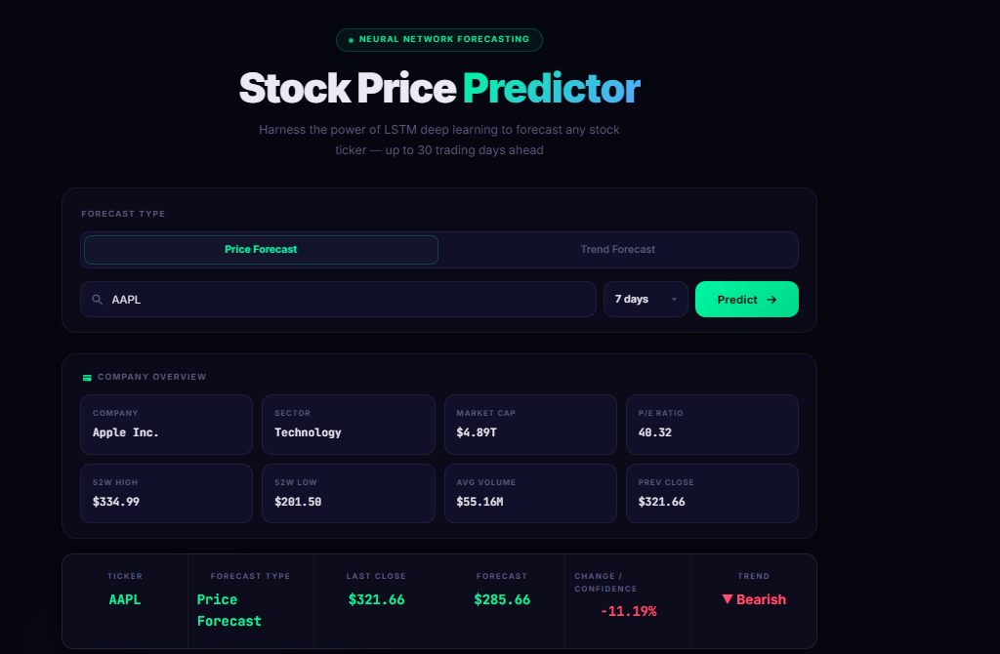
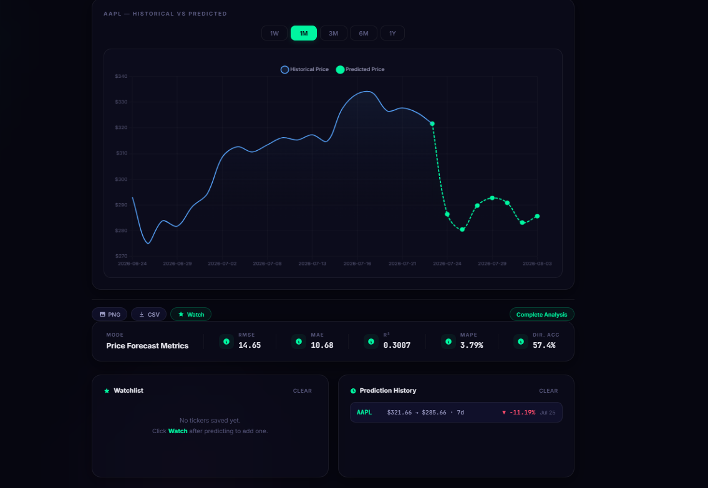

# StockLSTM - Browser-trained stock forecasting

[](https://github.com/AnasBabari/stock-predictor-lstm/actions) [](https://www.python.org/) [](https://fastapi.tiangolo.com/) [](https://react.dev/) [](https://www.tensorflow.org/js) [](LICENSE)

StockLSTM is a React and FastAPI stock-forecasting application. The FastAPI service retrieves Yahoo Finance history and returns a validated feature snapshot. A compact TensorFlow.js LSTM trains in each user's browser, runs in a Web Worker, and stores that user's model in IndexedDB. Render supplies data and calendar dates; it does not train models, load Keras artifacts, or retain model weights.

> [!WARNING]
> Educational project only. Forecasts, indicators, and sentiment are not financial advice.

> [!NOTE]
> GitHub Actions runs locked dependency checks, Ruff, Mypy, Bandit, pip-audit, API-documentation drift checks, backend and frontend tests/builds, and Docker Compose smoke tests. The local verification workflow may intentionally skip Bandit, but the CI gate remains active.

## Live Demo

- Frontend: <https://stock-predictor-lstm-two.vercel.app>
- Backend API: <https://stock-predictor-lstm.onrender.com>
- Swagger UI: <https://stock-predictor-lstm.onrender.com/docs>
- OpenAPI schema: <https://stock-predictor-lstm.onrender.com/openapi.json>

## Product Tour

| Price forecast dashboard | Direction forecast |
| --- | --- |
|  |  |

- Search for a ticker or enter an exact symbol, then choose a 1–30 trading-day horizon.
- The first forecast downloads a bounded feature snapshot and trains a local model. Progress, the worker backend, holdout metrics, and cache status are shown in the UI.
- Reloading the page can load the same ticker/type model from IndexedDB. Price and direction models are separate, per browser, per ticker, and never uploaded.
- If workers, WebGPU/WebGL/CPU TensorFlow.js, or local storage are unavailable, the UI explicitly labels the deterministic persistence/base-rate fallback.
- Save results to browser-local watchlists/history and export PNG, CSV, or complete ZIP analyses.

## Architecture and data contract

The production pipeline uses **Stationary Schema v4 (28 ordered features)**: relative price returns, stationary technical indicator ratios, momentum/realized volatility measures, market-context returns, rolling Beta, and cyclical calendar values. Browser training uses a 60-session input window, a 30-step model output, an 80% training split, a train-only robust or min/max scaler, and a `forecast_days - 1` purge at the train/holdout boundary. The price target is cumulative log return ($r_{t,h} = \ln(P_{t+h}/P_t)$), with prices reconstructed from the latest close; the direction target is a positive future log return.

`GET /api/v1/training-data?ticker=MSFT` returns the validated 28-feature matrix, historical closes, backend-generated future trading dates, feature schema version (`schema_version: 4`), target contract (`target_mode: cumulative_log_return_v1`), and a deterministic `snapshot_id`. The frontend invalidates a cached model when that snapshot, schema, feature list, window, output width, or implementation version changes. The service bounds the snapshot to the configured historical period and 2,000 rows, returns finite numeric values only, and applies a dedicated 10-per-minute limit.

Three local training profiles are available:

| Profile | Model and evaluation | Typical capable-desktop time |
| --- | --- | --- |
| Quick | LSTM 32/16, 12 epochs maximum, one untouched purged holdout | 30–90 seconds |
| Balanced | LSTM 64/32, 25 epochs maximum, one untouched purged holdout | 2–10 minutes |
| Research | Balanced model, five expanding 60-session purged folds, then a final fit | 10–45+ minutes |

Balanced is the capable-desktop default; constrained or mobile devices default to Quick. Research is always an explicit choice. The worker tries WebGPU, then WebGL, then CPU. All profiles use batch size 32, Adam 0.001, no shuffle, train-only scaling, early stopping, and a final refit for local inference. Browser GPU results are methodologically reproducible from the recorded snapshot, profile, seed, split, and runtime metadata, but are not guaranteed to be bit-identical across browsers.

Quick and Balanced metrics are labelled `browser_purged_holdout`. Research metrics are aggregated from untouched predictions and labelled `browser_walk_forward_out_of_fold`; incomplete or cancelled folds never receive that label. Price evidence includes MAE, MSE, RMSE, MAPE, R², and relative MAE/RMSE versus persistence. Direction evidence includes accuracy, precision, recall, F1, balanced accuracy, Brier score, and majority-class accuracy. Price forecasts do not claim an “accuracy” percentage.

The compatibility `/api/v1/predict` and `/api/v1/predict/direction` endpoints remain available during migration. Their response metadata always identifies `server_disabled_fallback`; they are not used for learned browser forecasts. `/models` reports `server_models.status = disabled` and `browser_training.status = available`.

## Server-side forecast serving

The server can also serve pre-trained, signed, versioned forecast bundles alongside the compatibility endpoints (hybrid mode). The routes are always registered but dormant by default: `SERVER_FORECAST_SERVING_ENABLED` defaults to `false`, and no ticker is served until `SERVER_FORECAST_ALLOWLIST` is configured and a fresh promoted artifact exists. Endpoints:

- `GET /api/v1/server-forecasts/availability` — running mode, configured allowlist, and per-ticker freshness (cached 300 s).
- `GET /api/v1/server-forecasts/{ticker}?forecast_type=price|direction&days=N` — a persisted bundle when fresh and compatible; otherwise `200 OK` with `{available: false, fallback: "browser_training"}` in the browser training modes. In `server_pretrained` mode a missing/stale/incompatible bundle is a `503`; infrastructure failures (registry unavailable, unreadable bundle, digest mismatch, failed signature verification) always fail closed with `503`. Successful responses carry `ETag` = bundle version ID and are cached 900 s.

Artifacts come only from an explicit background job (`backend/scripts/run_server_training.py`). The job is torch-free: it evaluates the `elastic_net` family on the full 1–30-day horizon range without the histogram gradient booster, and promotes a signed, digest-checked bundle only when pooled `relative_rmse < 0.98` and `relative_mae < 0.98`. Each bundle records reproducibility metadata (git commit, scaler parameters, feature names, per-horizon metrics) and embeds the last 120 trading days of history for the chart. Bundles are immutable in storage and versioned by ticker, forecast type, training timestamp, git SHA, and snapshot fingerprint; serving verifies the Ed25519 signature with the configured public key and there is deliberately no digest-only acceptance mode (a missing key means serving is `unconfigured`, a broken key is `integrity_failure`, both fail closed). Serving stays dormant until an allowlisted ticker actually has a fresh promoted artifact, so free-tier memory and CPU budgets are unaffected; `/models` still reports server models disabled. See [docs/server_models.md](docs/server_models.md).

## News and sentiment

Live Yahoo Finance headlines are still fetched for the direction response as context (`sentiment.status`/coverage metadata). They are deliberately not sent in the 28-feature browser matrix, so headline sentiment cannot silently become a learned input. Historical news experiments remain offline-only and must use timestamped articles, leakage-safe alignment, controlled ablations, and the same purged holdout/promotion gates as price features. This separation keeps the browser model reproducible and makes the current news limitation explicit instead of claiming that sentiment improves the forecast.

## Docker Compose

```bash
git clone https://github.com/AnasBabari/stock-predictor-lstm.git
cd stock-predictor-lstm
docker compose build
docker compose up
```

Open <http://localhost:5500>. Nginx serves the frontend on port 5500 and proxies `/api/` to the lightweight FastAPI service. The backend binds to loopback for local access and the internal Compose network for the proxy. No model volume is required. The same browser worker/IndexedDB flow is used locally and on Render.

## Local development

Requires Python 3.11+ and Node.js `>=20.19.0 <21` or `>=22.12.0` with npm. The backend reads `.env` from its working directory; copy the example to `backend/.env`.

```powershell
cd backend
uv sync --project . --frozen --no-dev
uv run --project . uvicorn api:app --reload --port 8000
```

```bash
cd frontend
npm ci
npm run dev
```
