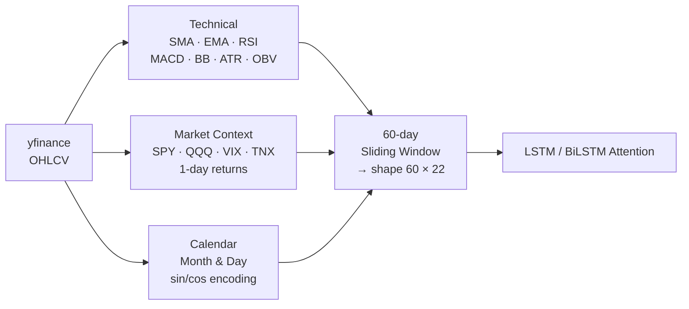
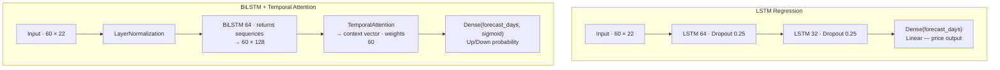
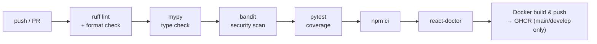

# StockLSTM — AI Stock Price Predictor

[](https://github.com/AnasBabari/stock-predictor-lstm/actions)
[](https://www.python.org/)
[](https://fastapi.tiangolo.com/)
[](https://react.dev/)
[](https://www.tensorflow.org/)
[](LICENSE)
[](https://stock-predictor-lstm.onrender.com)
[](https://stock-predictor-lstm-two.vercel.app)
[](https://github.com/AnasBabari/stock-predictor-lstm/pkgs/container/stock-predictor-lstm)

---

## Live Demo

Frontend: https://stock-predictor-lstm-two.vercel.app  
Backend API: https://stock-predictor-lstm.onrender.com

---

**StockLSTM** is a full-stack stock forecasting platform combining an **LSTM regression model** for price forecasting with a **BiLSTM + temporal attention model** for directional prediction. Historical market data is retrieved from Yahoo Finance, processed through a feature-engineering pipeline, and served via a FastAPI REST API to an interactive React dashboard powered by Chart.js.

> [!IMPORTANT]
> **Highlights**
> - Full-stack ML application — FastAPI backend + React 18 frontend
> - LSTM regression model for multi-step price prediction
> - BiLSTM with temporal attention for up/down direction prediction
> - Walk-forward validation (5-fold expanding window)
> - 22 engineered features: OHLCV, technical indicators, market context, calendar
> - Financial sentiment via VADER with financial lexicon
> - Model caching with automatic retraining when stale
> - 56 automated backend tests · 80.5% test coverage
> - Docker Compose support
> - Live deployment on Render + Vercel

> ⚠️ **Disclaimer** — Educational project only. Not financial advice.

---

## Screenshots

| Price Forecast Dashboard | Direction Prediction |
|---|---|
|  |  |

---

## Tech Stack

**Backend**
- FastAPI
- TensorFlow / Keras
- scikit-learn
- yfinance
- pandas
- NumPy

**Frontend**
- React
- Vite
- Chart.js (react-chartjs-2)

**Deployment**
- Render (backend)
- Vercel (frontend)
- Docker Compose

---

## Features

| Feature | Detail |
|---|---|
| **Price forecasting** | LSTM model predicts raw closing prices for 1–30 trading days |
| **Trend prediction** | BiLSTM with temporal attention for directional classification (up/down) |
| **Attention-based BiLSTM** | Per-timestep attention weights for interpretability |
| **Walk-forward validation** | 5-fold expanding window evaluation |
| **Technical indicator engineering** | 9 technical indicators: SMA, EMA, RSI, MACD, BB, ATR, OBV |
| **Cross-asset features** | Market context from SPY, QQQ, VIX, TNX |
| **Financial sentiment** | VADER with financial lexicon applied to yfinance news headlines |
| **Calendar features** | Month and day sin/cos encoding |
| **Interactive charts** | Chart.js visualisations with dynamic timeframe selection |
| **Watchlist** | LocalStorage-persisted watchlist with one-click predictions |
| **Prediction history** | Recent forecast history with change tracking |
| **PNG/CSV export** | Export charts as PNG, data as CSV, or complete analysis as ZIP |
| **Model caching** | .keras + fitted MinMaxScaler persisted; auto-retrain after configurable days |
| **Automatic retraining** | Staleness detection triggers retrain on next request |
| **REST API** | Rate-limited endpoints with OpenAPI docs |
| **Docker deployment** | Docker Compose with health checks and persistent model volumes |
| **CI/CD** | GitHub Actions with lint, type-check, security scan, tests, coverage gate, and Docker builds |

---

## Architecture

```
React (Vite)
        │
        ▼
FastAPI REST API
        │
        ▼
  Prediction Service
        │
  ┌──────┴────────┐
  ▼               ▼
 LSTM         BiLSTM + Attention
        │
        ▼
  TensorFlow / Keras
```

### Detailed Data Flow


```mermaid
graph TD
    Browser["React 18 · Vite 5"] -->|REST| API["FastAPI 0.115+"]

    subgraph Backend
        API --> Val["Input Validation\n+ Rate Limiting"]
        Val --> Price["LSTM Regression\n/api/v1/predict"]
        Val --> Dir["BiLSTM Attention\n/api/v1/predict/direction"]
        Val --> Diag["Diagnostics\n/api/v1/diagnostics/{ticker}"]
        Price & Dir --> MM["Model Manager\n(load / train / cache)"]
        MM --> DP["Data Pipeline\nyfinance + 22 features"]
        MM --> Disk["saved_models/\n.keras · .joblib · metadata"]
        Dir --> News["VADER Sentiment"]
    end
```

### Feature Engineering Pipeline


```mermaid
graph LR
    Raw["yfinance\nOHLCV"] --> Tech["Technical\nSMA · EMA · RSI\nMACD · BB · ATR · OBV"]
    Raw --> Market["Market Context\nSPY · QQQ · VIX · TNX\n1-day returns"]
    Raw --> Cal["Calendar\nMonth & Day\nsin/cos encoding"]
    Tech & Market & Cal --> Window["60-day\nSliding Window\n→ shape 60 × 22"]
    Window --> Models["LSTM  /  BiLSTM Attention"]
```

### Model Architecture


```mermaid
graph TD
    subgraph "LSTM Regression"
        I1["Input · 60 × 22"] --> L1["LSTM 64 · Dropout 0.25"]
        L1 --> L2["LSTM 32 · Dropout 0.25"]
        L2 --> O1["Dense(forecast_days)\nLinear — price output"]
    end

    subgraph "BiLSTM + Temporal Attention"
        I2["Input · 60 × 22"] --> LN["LayerNormalization"]
        LN --> BL["BiLSTM 64 · returns sequences\n→ 60 × 128"]
        BL --> TA["TemporalAttention\n→ context vector · weights 60"]
        TA --> O2["Dense(forecast_days, sigmoid)\nUp/Down probability"]
    end
```

### CI/CD Pipeline


```mermaid
graph LR
    PR["push / PR"] --> B1["ruff lint\n+ format check"]
    B1 --> B2["mypy\ntype check"]
    B2 --> B3["bandit\nsecurity scan"]
    B3 --> B4["pytest\ncoverage"]
    B4 --> F1["npm ci"]
    F1 --> F2["react-doctor"]
    F2 --> D["Docker build & push\n→ GHCR (main/develop only)"]
```

---

## Deployment

**Frontend**
- Hosted on Vercel
- Automatically redeployed on pushes to `main`

**Backend**
- Hosted on Render
- FastAPI + TensorFlow with persistent disk for cached models
- CORS origins are configured via the `CORS_ORIGIN` environment variable, allowing the deployed Vercel frontend to communicate securely with the Render-hosted backend.

---

## Quick Start — Docker

```bash
git clone https://github.com/AnasBabari/stock-predictor-lstm.git
cd stock-predictor-lstm
docker compose up --build
```

Open `http://localhost:5500`. On first use, selecting a new ticker trains the model on demand (~1–3 min). Subsequent requests load the cached model instantly.

---

## Local Development

### Prerequisites

- Python 3.11+
- Node.js 18+ and npm 9+

### Backend

```bash
cd backend
python -m venv venv
source venv/bin/activate        # Windows: .\venv\Scripts\Activate.ps1
pip install -r requirements.txt -r requirements-dev.txt
cp ../.env.example ../.env
uvicorn api:app --reload --port 8000
```

API: `http://127.0.0.1:8000` · Swagger UI: `http://127.0.0.1:8000/docs`

### Frontend

```bash
cd frontend
npm ci
npm run dev     # Vite dev server → http://localhost:5500
```

---

## Environment Variables

| Variable | Default | Description |
|---|---|---|
| `CORS_ORIGIN` | (unset) | Production frontend origin for FastAPI CORS |
| `CACHE_TTL` | `300` | Prediction cache TTL |
| `CACHE_MAX_SIZE` | `256` | Cache size |
| `MODEL_MAX_AGE_DAYS` | `7` | Retrain threshold (days) |

Full list in `.env.example`.

---

## API

Full specification: [`docs/API.md`](docs/API.md)

| Endpoint | Description |
|---|---|
| `GET /health` | Liveness probe |
| `GET /ready` | Readiness probe |
| `GET /models` | Cached model manifest |
| `GET /api/v1/predict` | LSTM price forecast + evaluation metrics |
| `GET /api/v1/predict/direction` | BiLSTM direction forecast · attention weights · sentiment |
| `GET /api/v1/diagnostics/{ticker}` | Walk-forward validation diagnostics |
| `GET /api/v1/search` | Ticker autocomplete |
| `GET /api/v1/info` | Stock fundamentals |

---

## Testing

```bash
# Backend
cd backend
pytest tests/ -v --cov=. --cov-report=term-missing --cov-fail-under=70

# Frontend
cd frontend
npm run test:run
```

---

## Project Metrics

| Metric | Value |
|---|---|
| Backend tests | 56 |
| Test coverage | 80.5% |
| Engineered features | 22 |
| Neural network architectures | 2 (regression + directional) |
| Walk-forward folds | 5 |
| Backend API endpoints | 8 |
| Forecast horizon | 1–30 days |
| Input window size | 60 days |
| Deployment | Render + Vercel |

---

## Documentation

- [`docs/ARCHITECTURE.md`](docs/ARCHITECTURE.md) — system design, data flow, design decisions
- [`docs/API.md`](docs/API.md) — full endpoint specification with examples

---

## License

MIT License — see [`LICENSE`](LICENSE) for details.
