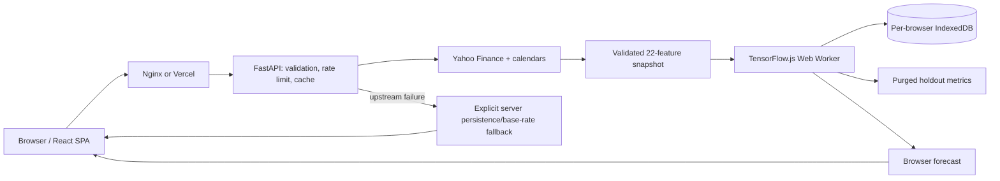

# Architecture

## Production request flow

The React SPA requests a fresh, validated feature snapshot from FastAPI. In Compose, Nginx proxies same-origin `/api/` paths to the backend and overwrites the forwarding chain at the trusted boundary. Render runs only the lightweight data service: no TensorFlow import, Keras artifact, model directory, boot-time pretraining, or model-weight upload is part of the production request path.

`GET /api/v1/training-data?ticker=MSFT` is the only learned-forecast input. It validates the ticker, fetches one coherent market snapshot, preserves the 22-feature order, emits finite rows and backend calendar dates, and fingerprints the exact payload with a deterministic `snapshot_id`. The response is bounded to the historical period and 2,000 rows, rate-limited separately, and never accepts client feature matrices.

The compatibility `/api/v1/predict` and `/api/v1/predict/direction` endpoints remain for rollback and unsupported clients. They return persistence or recent-base-rate outputs with `server_disabled_fallback` metadata. A flat compatibility response is never presented as a learned model.

## Browser model boundary

The worker uses the same core semantics as the Python pipeline:

- 60 trading-day input window and 30-step output width.
- 80% chronological split with a `forecast_days - 1` purge.
- Min/max scaler fitted only on training rows.
- Price target is scaled `Close`; direction target is positive future log return.
- No shuffle, at most 12 epochs, batch size 32, validation early stopping after three unimproved epochs.
- WebGL where available, CPU otherwise; all tensors are disposed on cancellation, error, and completion.

Price uses `LSTM(32, return_sequences) -> Dropout(.2) -> LSTM(16) -> Dense(16, relu) -> Dense(30, linear)` with Adam/MSE. Direction uses the same body with a sigmoid output and binary cross-entropy. A model trains only for the selected type; Complete Analysis requests the missing type only.

The browser cache key includes model implementation version, schema version, ticker, forecast type, snapshot ID, window size, and output width. TensorFlow.js saves weights to `indexeddb://...`; companion metadata records metrics, schema, timestamps, and feature names. Cache entries are per browser and ticker/type, expire/evict under the seven-day and six-entry policy, and can be cleared by the user. IndexedDB failure downgrades persistence to a session-only model; worker/training failure uses a labelled baseline.

Browser metrics are calculated on untouched post-purge holdout samples and labelled `browser_purged_holdout`: price MAE/MSE/RMSE/MAPE/R² and relative errors versus persistence; direction accuracy/precision/recall/F1/balanced accuracy/Brier score and naive baseline. They are not the offline five-fold walk-forward metrics.

## Data and news boundary

The production feature matrix has 22 ordered columns: five OHLCV, nine technical, four market-context returns, and four cyclic calendar features. Market context is aligned to the last known close before each session; no future value is filled in. Exchange calendars support international suffixes and 24/7 crypto pairs, with unknown dotted symbols returned as an explicit NYSE fallback.

Live Yahoo Finance headlines are normalized and scored for direction-response context only. Headline sentiment is not in the browser feature matrix, so the UI does not claim news improved the learned model. Historical news experiments accept timestamped articles only, align publication time before each session, expose coverage/decay metadata, and require controlled ablation and purged promotion evidence before any future schema change.

## Offline research and training boundary

The Python TensorFlow trainer, artifact registry, walk-forward evaluator, candidate baselines, and promotion commands remain available in the opt-in `training` dependency group. They may write local artifacts under an operator-selected directory for research and benchmark reproducibility. They are not imported by `api.py`, installed by the Render production build, called by `render.yaml`, or reachable from public request handling.

Offline validation supports expanding and rolling folds with training-only scalers, purged early-stopping tails, per-horizon and pooled origin/horizon metrics, persistence-relative errors, and direction baselines. Promotion is an explicit operator action; no offline artifact is deployed automatically to Render.

## Caching and concurrency

The backend response cache stores only bounded market-data-derived baseline responses. Its identity includes ticker, horizon, and forecast type, and cache hits do not load or validate model artifacts. The browser independently fetches a current snapshot before loading a cached model, so a changed snapshot forces retraining.

Compatibility requests still use a bounded coalescing executor, short-lived status registry, rate limits, upstream circuit breaker, and sanitized error responses. These controls protect the data service; browser training capacity is isolated to each user's device.

## Security boundaries

Ticker identities are validated before any upstream or path selection. Forwarded client addresses affect rate limiting only when the direct peer is an exact configured trusted proxy; direct callers cannot spoof another bucket. Nginx replaces, rather than appends to, forwarding headers. CORS allows explicit origins without credentials, internal errors are sanitized, and no model weights or user identifiers are sent to Render. React renders external text as text nodes; export identity/length checks and CSV formula neutralization remain in place.