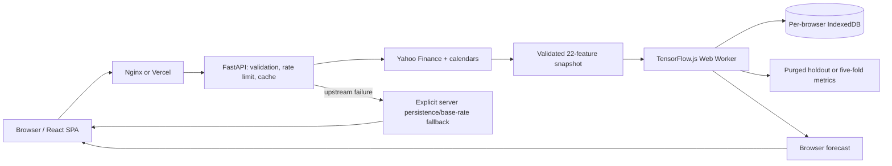

# Architecture

## Production request flow

The React SPA requests a fresh, validated feature snapshot from FastAPI. In Compose, Nginx proxies same-origin `/api/` paths to the backend and overwrites the forwarding chain at the trusted boundary. Render runs only the lightweight data service: no TensorFlow import, Keras artifact, model directory, boot-time pretraining, or model-weight upload is part of the production request path.

`GET /api/v1/training-data?ticker=MSFT` is the only learned-forecast input. It validates the ticker, fetches one coherent market snapshot, preserves the 22-feature order, emits finite rows and backend calendar dates, and fingerprints the exact payload with a deterministic `snapshot_id`. The response is bounded to the historical period and 2,000 rows, rate-limited separately, and never accepts client feature matrices.

The compatibility `/api/v1/predict` and `/api/v1/predict/direction` endpoints remain for rollback and unsupported clients. They return persistence or recent-base-rate outputs with `server_disabled_fallback` metadata. A flat compatibility response is never presented as a learned model.

## Browser model boundary

The worker offers three immutable profiles. Quick uses a 32/16-unit LSTM for a single purged holdout; Balanced uses a 64/32-unit LSTM with two dropout layers and a single purged holdout; Research uses the Balanced architecture for five expanding 60-session folds before a final fit. The shared semantics are:

- 60-session inputs, 30 outputs, batch size 32, Adam 0.001, and no shuffle.
- A train-only min/max scaler and a 29-sample purge at every evaluation or early-stopping boundary.
- Linear/MSE price output and sigmoid/binary-cross-entropy direction output.
- WebGPU, WebGL, then CPU selection, with runtime and capability metadata recorded.
- Cooperative cancellation, tensor disposal, and final-model refitting using the selected epoch count.

Research requires at least 300 fitting sequences before its first validation fold. Each fold has its own scaler and purged early-stopping tail; untouched out-of-fold predictions are pooled before metrics are calculated. Completed fold summaries are checkpointed for 24 hours, but partial work is never labelled as a completed benchmark.

Cache keys include architecture/model versions, schema, ordered-feature signature, ticker, forecast type, profile, backend, snapshot, window, and output width. Final models and companion evidence use IndexedDB, expire after seven days, and are bounded to six models and 200 MiB. Higher-quality successful profiles evict lower-quality variants for the same ticker/type. Storage failures retain only the current session model.

Quick/Balanced evidence uses `browser_purged_holdout`; Research uses `browser_walk_forward_out_of_fold`. Price results show errors and persistence-relative ratios, not “accuracy.” Direction results disclose accuracy and the majority-class baseline. TensorFlow.js GPU kernels may differ numerically by browser, so reproducibility is defined by the recorded snapshot, seed, profile, splits, TensorFlow.js version, and backend rather than bit-identical weights.

## Data and news boundary

The production feature matrix has 22 ordered columns: five OHLCV, nine technical, four market-context returns, and four cyclic calendar features. Market context is aligned to the last known close before each session; no future value is filled in. Exchange calendars support international suffixes and 24/7 crypto pairs, with unknown dotted symbols returned as an explicit NYSE fallback.

Live Yahoo Finance headlines are normalized and scored for direction-response context only. Headline sentiment is not in the browser feature matrix, so the UI does not claim news improved the learned model. Historical news experiments accept timestamped articles only, align publication time before each session, expose coverage/decay metadata, and require controlled ablation and purged promotion evidence before any future schema change.

## Offline research and training boundary

The Python TensorFlow trainer, artifact registry, walk-forward evaluator, candidate baselines, and promotion commands remain available in the opt-in `training` dependency group. They may write local artifacts under an operator-selected directory for research and benchmark reproducibility. They are not imported by `api.py`, installed by the Render production build, called by `render.yaml`, or reachable from public request handling.

Offline validation supports expanding and rolling folds with training-only scalers, purged early-stopping tails, per-horizon and pooled origin/horizon metrics, persistence-relative errors, and direction baselines. Promotion is an explicit operator action; no offline artifact is deployed automatically to Render.

## Caching and concurrency

The backend response cache stores only bounded market-data-derived baseline responses. Its identity includes ticker, horizon, and forecast type, and cache hits do not load or validate model artifacts. The browser independently fetches a current snapshot before loading a cached model, so a changed snapshot forces retraining.

Compatibility requests still use a bounded coalescing executor, short-lived status registry, rate limits, upstream circuit breaker, and sanitized error responses. These controls protect the data service; browser training capacity is isolated to each user's device.

## Security boundaries

Ticker identities are validated before any upstream or path selection. Forwarded client addresses affect rate limiting only when the direct peer is an exact configured trusted proxy; direct callers cannot spoof another bucket. Nginx replaces, rather than appends to, forwarding headers. CORS allows explicit origins without credentials, internal errors are sanitized, and no model weights or user identifiers are sent to Render. React renders external text as text nodes; export identity/length checks and CSV formula neutralization remain in place.

## Deployment gate

The Render backend and Vercel frontend are guarded by repository smoke, resource-budget, and browser E2E checks. The gate intentionally separates repository validation from provider dashboard actions; see [DEPLOYMENT_GATE.md](DEPLOYMENT_GATE.md).
