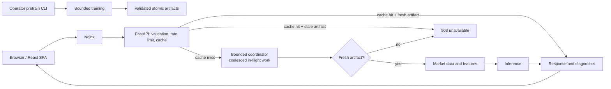
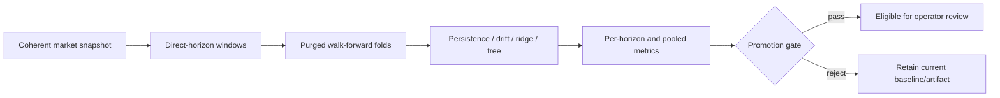

# Architecture

## Request flow

The React SPA calls same-origin `/api/` paths. In Compose, Nginx proxies those paths to FastAPI. A response-cache hit first revalidates its underlying artifact and is evicted with `503` if that artifact is no longer fresh. Cache misses enter a bounded, coalescing executor, but the worker first requires a fresh validated artifact. Missing or invalid artifacts fail with `503` before market data is fetched. TensorFlow training is reachable only from the operator CLI.

Prediction identity includes ticker, horizon, and type at the response/cache layer. Direction artifact identity deliberately uses a fixed 30-session output width; metadata and the Keras signature are checked before a shorter response is sliced.

## Data and ML boundaries

There are 22 ordered features: OHLCV (5), technical (9), market context (4), and cyclic calendar values (4). Market context schema v2 carries the last known close across a closed benchmark session before calculating its return. It never fills from the future. Any source that cannot be aligned from a prior observation fails closed with provenance rather than producing an indistinguishable zero.

Live news does not cross the production feature boundary. It is normalized and scored only for response context. Offline historical-news experiments accept timestamped records, expose decayed sentiment/count/confidence columns, and reject untimestamped records from model features. News columns are opt-in ablations rather than part of the 22-feature artifact schema.

Validation supports two real strategies:

- `expanding`: training starts at row zero and grows each fold.
- `rolling`: training uses exactly `min_train_size` rows before each gap.

Each fold has an exact `horizon` and `gap`. A scaler fits only on the fold's training rows. An inner tail of that training fold supplies early stopping, with an additional purge equal to the overlapping target width; the subsequent evaluation fold is not passed to `fit`.

Regression forecasts retain a price origin for every row and a named horizon for every column. Metrics are calculated per horizon and over pooled origin–horizon pairs; directional accuracy compares each forecast with its own origin rather than taking differences over a flattened array. MASE and RMSSE use training-only scale data, and relative MAE/RMSE use a no-change persistence prediction from the same origin. Direction probability evaluation adds balanced accuracy, Brier score, and log loss, with the majority baseline selected from the training fold.

Only aggregated out-of-fold results are published. Production fitting is two-stage: a purged chronological tail selects the epoch count, then a newly initialized model is trained on all labelled sequences for that fixed number of epochs. Artifact metadata distinguishes selection epochs, selected epoch, purge width, and final refit sample count.

## Offline experiment and promotion flow

The offline CLI evaluates persistence, drift, ridge, and histogram-gradient-boosting baselines and records the snapshot hash, dataset boundaries, fold indices, feature group, target representation, and promotion reasons. Promotion requires meaningful pooled improvement over persistence, wins across multiple folds, scaled errors below one, and no catastrophic fold. TensorFlow candidates are prepared and evaluated through the artifact-training workflow; the benchmark CLI does not train them. Neither workflow automatically changes the model selected by a public endpoint.

Reproducibility metadata records Python/NumPy/scikit-learn/TensorFlow versions, seed, deterministic mode, feature schema, validation settings, input data range, snapshot hash, source provenance, and Git commit. Deterministic TensorFlow kernels remain platform-dependent; exact equivalence across different hardware/library builds is not promised.

## Persistence and concurrency

Operator-controlled training uses in-process and O_EXCL process locks to prevent duplicate same-artifact work. A global semaphore bounds simultaneous CLI training; public HTTP requests cannot acquire it. A candidate version is written to a unique directory, hashed, then activated with atomic replacement of `current.json`; the prior version is not removed first. Readers resolve only activated versions and validate metadata, feature order/count, output width, scaler shape/finiteness, and SHA-256 hashes before Keras/scaler loading. Scalers are JSON, not pickle/joblib.

Count, byte, and free-space quotas evict old artifact roots. Readiness verifies the storage can create a file and retains a configured free-space floor.

## Calendars and fallbacks

Suffix mapping covers `.L`, `.SW`, `.TO`, `.AX`, and `.HK`; unsuffixed instruments use NYSE. `-USD`, `-GBP`, `-EUR`, and `-USDT` pairs use a 24/7 calendar. Unknown dotted suffixes use `NYSE_FALLBACK`, which is returned in response metadata so consumers can identify the assumption.

## Security boundaries

Ticker/model identities are allowlisted before path construction. Public forecast endpoints have per-client rate limits plus bounded global capacity. Forwarded addresses affect the limiter only when the direct peer is an exact configured trusted proxy; all other callers are keyed by their direct address. CORS allows explicit origins and no credentials. Internal exceptions are not returned. External text renders through React text nodes, and export identity/length checks prevent cross-forecast ZIPs. CSV cells that begin with spreadsheet formula characters are neutralised. Model artifacts are trusted local server state and integrity checked; SHA-256 detects corruption but is not an authenticity signature against an attacker who can rewrite both data and hashes.
